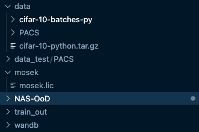

# repo-team5

### Out of Distribution NAS

Getting started:

1. SSH into pace cluster `[gt_userid]@coc-ice.pace.gatech.edu`
2. Clone repo from https://github.gatech.edu/cs8803smr-f22/repo-team5. Rename
   the cloned folder to `NAS-OoD`. (You can also clone into a folder called
   this). This is important because paths are hardcoded to have this as root folder.
2. load anaconda `module load anaconda3` (default is latest)
3. if first time, create conda env: `conda create -n ood-nas`
4. activate conda env: `conda activate ood-nas`
5. install the following:
  - `conda install pytorch torchvision torchaudio cudatoolkit=11.6 -c pytorch -c
    conda-forge`
  - `conda install -c conda-forge cvxpy`
  - `conda install -c mosek mosek`
  - `conda install -c conda-forge tensorboardx`
  - `conda install tqdm`
  - `pip install gdown`
  - `pip install wandb`

6. change the account in `.pbs` file and submit job to cluster `qsub NAS-OoD/train_run.pbs`
7. check status of job & also check `train-pace-1.out` for stderr and stdout.

[pace cheatsheet](https://docs.pace.gatech.edu/gettingStarted/commands/)

[pace docs](https://docs.pace.gatech.edu/ice_cluster/ice-guide/)

8. TO process and log logged data to wandb, update path to training log in the
   following script and run it:
```
$ python3 NAS-OoD/process_run_logs.py
```

### Misc

#### Mosek license
1. Copy the license (`mosek.lic`) and its folder `mosek` which is inside
   `NAS-OoD` to default path. For instance: `/storage/home/hcocice1/sp308/mosek/mosek.lic`
I have installed `NAS-OoD` in my root folder `/storage/home/hcocice1/sp308`,
hence this is the folder structure I see with `NAS-OoD` and `mosek`:



### Data downloading

#### PACS

```bash
$ python3 NAS-OoD/data_scripts/pacs_downloader.py  
```

This will create a `data` folder with the following structure:
```
+-- data
  +-- PACS
      +-- art_painting (contains folders (classes) of art painting images)
      +-- cartoon (contains folders (classes) of cartoon images)
      +-- photo (contains folders (classes) of photo images)
      +-- sketch (contains folders (classes) of sketch images)
      +-- kfold (contains 4 txt files containing paths to images in PACS dataset)
```

> Change --targetdomain in `train_search_single.py` to evaluate on a different
> domain. Default is cartoon being left out.

### Git push/pull

External repo - `git push origin main`
GT Repo - `git push grading main` (name of GT github remote is grading)

----- From original readme

### Prerequisites

Python3.6. and the following packages are required to run the scripts:

- Python >= 3.7

- PyTorch >= 1.1 and torchvision

- CVXPY

- Mosek

### Code Structure

 - train_search_single.py
 - nas_ood_single
 - dataloader


### Demonstrations on NICO

bash main_search_onestage.sh


### References
```
@inproceedings{bai2021ood,
  title={Nas-ood: Neural architecture search for out-of-distribution generalization},
  author={Bai, Haoyue and Zhou, Fengwei and Hong, Lanqing and Ye, Nanyang and Chan, S-H Gary and Li, Zhenguo},
  booktitle={Proceedings of the IEEE/CVF International Conference on Computer Vision},
  year={2021}
}
```

